# StyleTransferGallery
Style transfer gallery for League of Legends (LoL) and hand-picked images.

# Summary
We used a pre-trained convolutional neural network to perform neural style transfer, which 
extracts the style of one image and the content of another and combines them into a new image, on splash art
images from the popular video game "League of Legends". We scraped ~1,300 images of champions
and skins from the game along with a few handpicked images for our dataset. We applied the
neural style transfer in a variety of ways, including using League of legends images as the content
and the handpicked typical nerual style transfer images as the style as well as League of Legegnds
images for both the style and content. We also explored modifying the weight of
the content and style loss functions impacts the output, the evolution of the output
as the optimization progresses, and using a different image as the base for the output.

## Motivation
After seeing examples of how style transfer can be used, we were interested in seeing how neural
style transfer could be applied to artwork from one of our favorite video games. As we began
applying the method to different images, we wanted to explore which parts of the model we
could tune/change and see how that impacts the resulting image.

## Technique
### What is neural style transfer?
Neural style transfer is an algorithm that allows you to combine the "style" of one
image and the "content" of another image to produce a new image.

### How does it work?
Generally, a pre-trained convolutional neural network (CNN) is used. In our case, we utilize
a VGG network with 19 layers. The higher levels of CNNs general have feature maps that produce
the content, so we can extract content by feeding an image through higher levels of a CNN and
using the output. So, we use the layer 'conv_4' to extract content. To extract style, we build
a feature space off of responses from multiple layers in the network, meaning it can keep track
of information correlated across multiple layers. We utilized the layers 'conv_1', 'conv_2',
'conv_3', 'conv_4', and 'conv_5' to extract style.

To actually do the style transfer, we start with a content image and a style image. Then, we create a
new image that will act as our output (this can be random noise or a copy of the content image;
for our work, we chose a copy of the content image). We then optimize the output image with respect to
a loss function containing a content term and a style term. For most of our experiments, we optimized
with 300 steps using the LBFGS optimizer.

## Data
We used artwork from a popular videogame: "League of Legends." In particular, we webscraped
splash arts for different skins for each champion (each character) in the game from
https://lolskinshop.com/product-category/lol-skins/ using Selenium and Python and from 
https://www.leagueoflegends.com/en-us/champions/ using Parsehub. In total,
we scraped over 1300 images. 

In addition, we hand-picked images from the web that we thought could be interesting
style images; we called these "Traditional Style Images", since they are the types of
images we saw often used in style transfer work (i.e., images with lots of distinct geometric
shapes and colors).

## Gallery

### Featured Examples

These are some of the style transfers we thought worked the best.

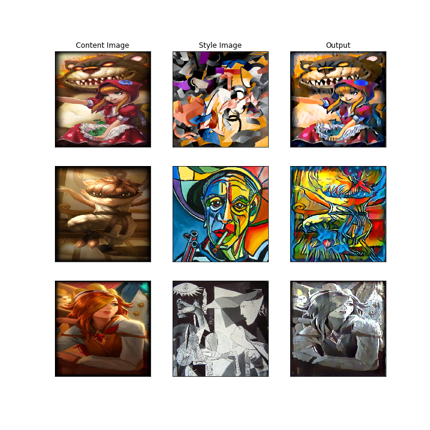

### League of Legends and Traditional Style Images
This is an assortment of style transfer images.
Each image in the first row indicates the style image, and each image in the first column
indicates the content image. 

### League of Legends and League of Legends
We also ran picked LoL images for both content and style. Here are some of the results:

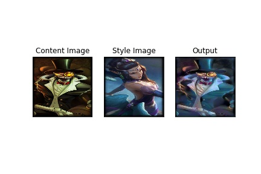
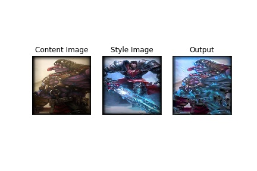
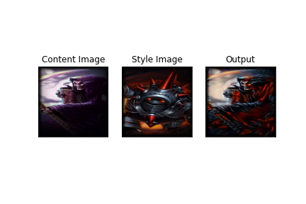
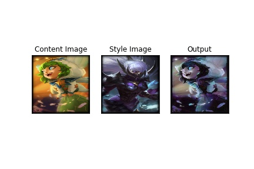
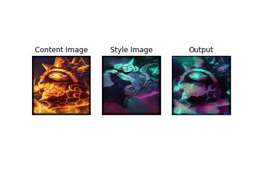
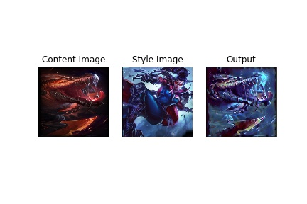
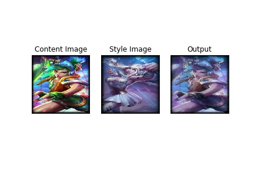
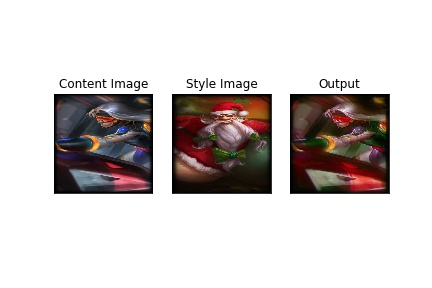
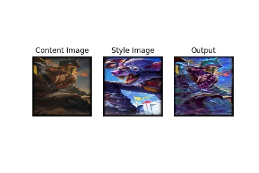
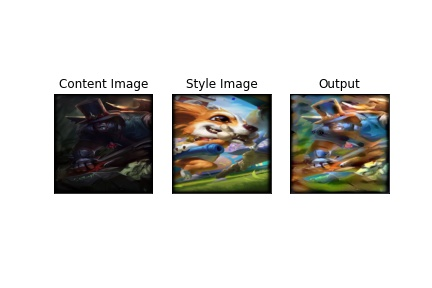
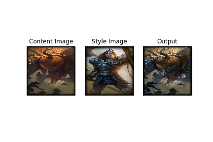
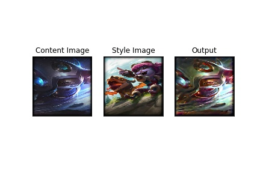

Some of these worked quite well and looked like real skins you could find in the game. Some of them didn't work so well,
and simply like some a little bit of color was thrown on.

### Experimenting with the loss function
We experimented with modifying the weight assigned to the content portion of the loss
and the style portion of the loss. The grids below showcase some examples for "base",
"increased content," and "increased style" sets of weights. "Base" refers to 1000000 and 1 for
style and content loss, respectively. "Increased content" refers to 1000000 and 100 assigned to style
and content, respectively. "Increased style" refers to 1000000000 (so 1000 times the base) and 1 assigned
to style and content, respectively. We also experimented with other examples, but chose these values
as good examples to visualize.

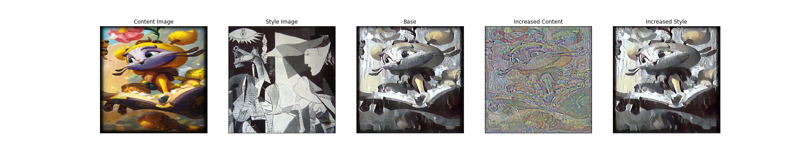
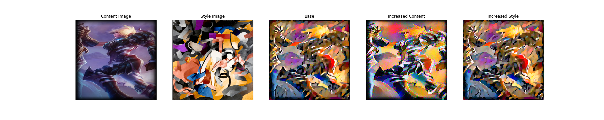

It seems that increasing the content loss can dramatically effect the content. It can make the curves from
the original image more pronounced, though in the middle example, this is not the case. In addition, the color
seems to be morphed.

Increasing the style loss does not seem to have a significant effect. If you look closely (for instance, at the very
last row), the colors in some locations are more pronounced, though the effect seems minimal.

### Evolution
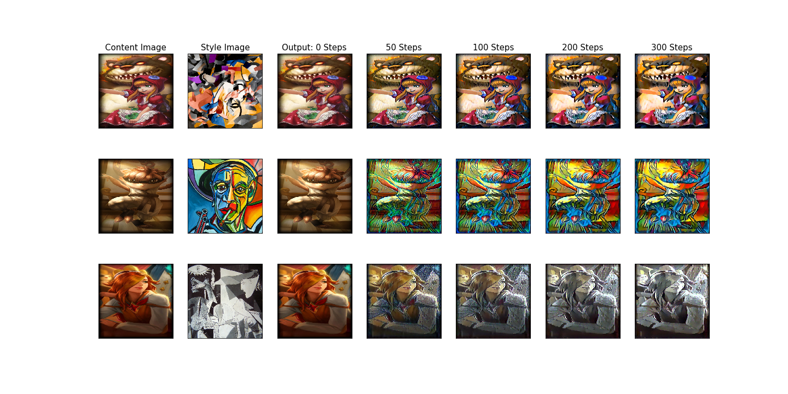

This grid shows, for a few select examples, the evolution of the output as optimization progresses.
We show images for 0 (hasn't started yet), 50, 100, 200, and 300 (finished) optimization steps.

We also show these, as well as a few more examples, in the following gifs (we utilized a smaller frame size for these gifs,
due to memory constraints):

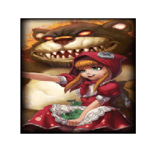
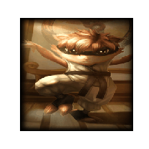
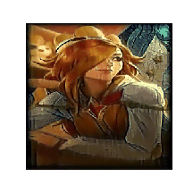
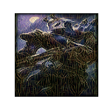
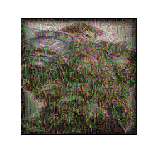
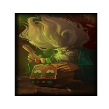

### Initialization
We experiment using different initial images to optimize with. For all of the images above, we utilized the content image
to be the initial image, and we utilized 5000 optimization steps (as opposed to 300 for all the other experiments).
However, for the grids below, we experiment with different images to see what happens. The grid shows the content, style, initial,
and output images. We also have a gif over the course of training.

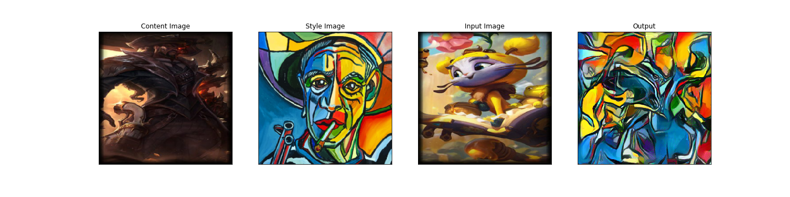
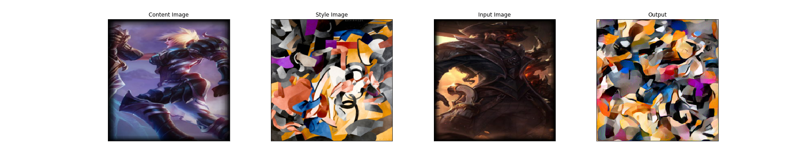
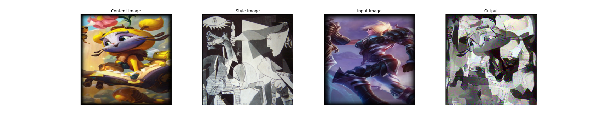

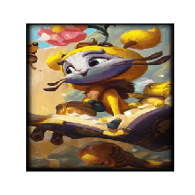
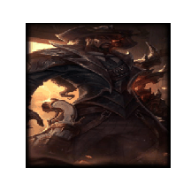

These were quite interesting! It seems that whatever initialization we use can drastically affect the output.

## Discussion
Style transfer seems to work best when the different parts of the content are clearly defined. In addition, 
it seems to perform better when the chosen "style" includes simple, distinct geometric shapes. Furthermore,
tuning the weight of the style loss doesn't seem to drastically affect the output, while tuning the weight
of the content loss has a big effect. Our experiments also show that the initialization chosen can have a
large impact on the output, although it's possible that using even more optimization steps could change the
result.

## Conclusion
Neural style transfer is a wonderful algorithm that can produce some really beautiful
images. It provides a very interesting case study into the power of CNNs, as well as
what different layers in a CNN's hierarchy do. It's also quite fun to play with :).

## References

https://pytorch.org/tutorials/advanced/neural_style_tutorial.html

https://arxiv.org/abs/1508.06576

https://pythonspot.com/selenium-get-images/

https://www.youtube.com/watch?v=sPUzhKNZmho

https://lolskinshop.com/product-category/lol-skins/

https://www.leagueoflegends.com/en-us/champions

https://www.xpertup.com/wp-content/uploads/2019/09/Universal-Neural-Style-Transfer-with-Color-Mask-Post-Processing.jpg

https://upload.wikimedia.org/wikipedia/commons/thumb/e/ea/Van_Gogh_-_Starry_Night_-_Google_Art_Project.jpg/1200px-Van_Gogh_-_Starry_Night_-_Google_Art_Project.jpg

https://harishnarayanan.org/images/writing/artistic-style-transfer/wave.jpg

https://harishnarayanan.org/images/writing/artistic-style-transfer/edtaonisl.jpg

https://images.squarespace-cdn.com/content/v1/5800c6211b631b49b4d63657/1485510913507-MZIMDX7HYLB5UT1O6IP5/image-asset.jpeg

https://m.media-amazon.com/images/I/81Voo1m1kEL._AC_SL1402_.jpg

https://the-public-domain-review.imgix.net/collections/the-geometric-landscapes-of-lorenz-stoer-1567/El54_qt_19.jpg

https://numpaint.com/wp-content/uploads/2020/11/Pablo-Picasso-paint-by-number.jpg
