# StyleTransferGallery
Style transfer gallery for League of Legends (LoL) and hand-picked images.

## What is neural style transfer?
Neural style transfer is an algorithm that allows you to extract the "style" of
one image and transplant it onto another image, while keeping the "content" of
that second image intact.

## How does it work?
Generally, a pre-trained convolutional neural network (CNN) is used. In our case, we utilize
VGG. The higher levels of CNNs general have feature maps that produce the content, so
we can extract content by feeding an image through higher levels of a CNN and using the output.
To extract style, we build a feature space off of responses from multiple layers in the network,
meaning it can keep track of information correlated across multiple layers.

To actually do the transplant, we extract a content image and a style image. Then, we create a
new image that will act as our output (this can be random noise or a copy of the content image;
for our work, we chose the content image). We then optimize the output image with respect to
a loss function containing a content term and a style term.

## Data
We used artwork from a popular videogame: "League of Legends." In particular, we webscraped
splash arts for different skins for each champion (each character) in the game. In total,
we scraped over 1300 images. 

In addition, we hand-picked images from the web that we thought could be interesting
style images; we called these "Traditional Style Images", since they are the types of
images often used in style transfer work (i.e., images with lots of distinct geometric
shapes and colors).

## Gallery

### Featured Examples

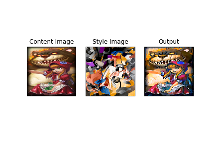
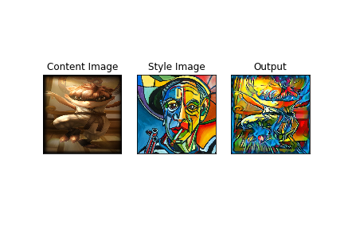
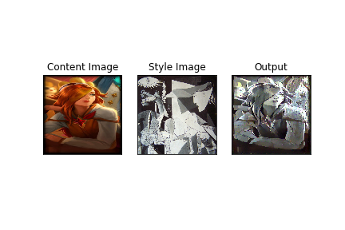

### League of Legends and Traditional Style Images
Each image in the first row indicates the style image. Each image in the first column
indicates the content image. 

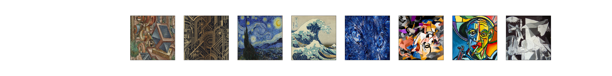
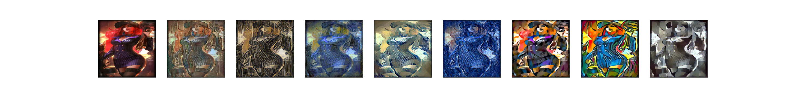
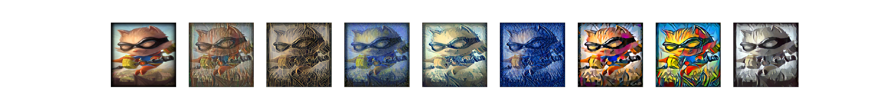
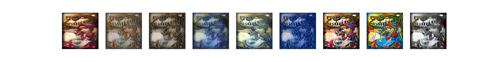
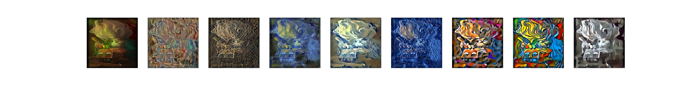
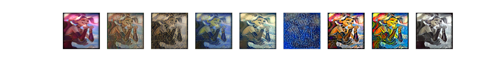
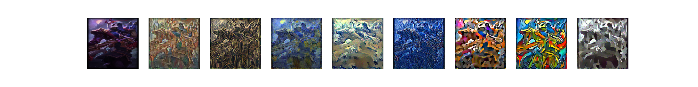
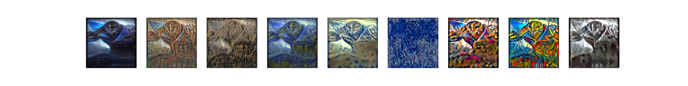
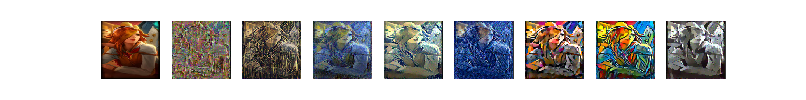
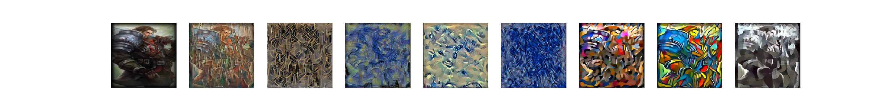
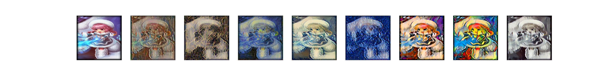

### League of Legends and League of Legends

### Experimenting with the loss function
We experimented with modifying the weight assigned to the content portion of the loss
and the style portion of the loss. Our base values assigned to each were 1 and 1000000
for style and content, respectively. 

## Discussion
Style transfer seems to work best when the different parts of the content are clearly defined.
In addition, it seems to perform better when the chosen "style" includes simple, distinct geometric
shapes.

## Conclusion
Neural style transfer is a wonderful algorithm that can produce some really beautiful
images. It provides a very interesting case study into the power of CNNs, as well as
what different layers in a CNN's hierarchy do. It's also quite fun to play with :).

## References

https://pytorch.org/tutorials/advanced/neural_style_tutorial.html

https://arxiv.org/abs/1508.06576