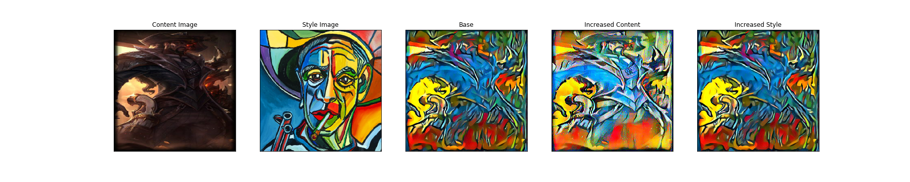
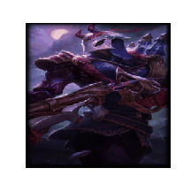
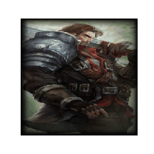
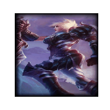

# StyleTransferGallery
Style transfer gallery for League of Legends (LoL) and hand-picked images.

## What is neural style transfer?
Neural style transfer is an algorithm that allows you to extract the "style" of
one image and transplant it onto another image, while keeping the "content" of
that second image intact.

## How does it work?
Generally, a pre-trained convolutional neural network (CNN) is used. In our case, we utilize
VGG. The higher levels of CNNs general have feature maps that produce the content, so
we can extract content by feeding an image through higher levels of a CNN and using the output.
To extract style, we build a feature space off of responses from multiple layers in the network,
meaning it can keep track of information correlated across multiple layers.

To actually do the transplant, we extract a content image and a style image. Then, we create a
new image that will act as our output (this can be random noise or a copy of the content image;
for our work, we chose the content image). We then optimize the output image with respect to
a loss function containing a content term and a style term.

## Data
We used artwork from a popular videogame: "League of Legends." In particular, we webscraped
splash arts for different skins for each champion (each character) in the game. In total,
we scraped over 1300 images. 

In addition, we hand-picked images from the web that we thought could be interesting
style images; we called these "Traditional Style Images", since they are the types of
images often used in style transfer work (i.e., images with lots of distinct geometric
shapes and colors).

## Gallery

### Featured Examples

### League of Legends and Traditional Style Images
Each image in the first row indicates the style image. Each image in the first column
indicates the content image. 

### League of Legends and League of Legends
We also ran picked LoL images for both content and style. Here are some of the results:

### Experimenting with the loss function
We experimented with modifying the weight assigned to the content portion of the loss
and the style portion of the loss. The grids below showcase some examples for "base",
"increased content," and "increased style" sets of weights. "Base" refers to 1000000 and 1 for
style and content loss, respectively. "Increased content" refers to 1000000 and 100 assigned to style
and content, respectively. "Increased style" refers to 1000000000 (so 1000 times the base) and 1 assigned
to style and content, respectively. We also experimented with other examples, but chose these values
as good examples to visualize.

It seems that increasing the content loss can dramatically effect the content; it can make the curves from
the original image more pronounced (though in the middle example, this is not the case). In addition, the color
is morphed.

Increasing the style loss does not seem to have a significant effect. If you look closely (for instance, at the very
last row), the colors in some locations are more pronounced, though the effect seems minimal.

### Evolution

This grid shows, for a few select examples, the evolution of the output as optimization progresses.
We show images for 0 (hasn't started yet), 50, 100, 200, and 300 (finished) optimization steps.

We also show these, as well as a few more examples, in the following gifs (we utilized a smaller frame size for these gifs,
due to memory constraints):

### Initialization
We experiment using different initial images to optimize with. For all of the images above, we utilized the content image
to be the initial image. However, for the grids below, we experiment with different images to see what happens. The grid
shows the content, style, initial, and output images. We also have a gif over the course of training.

## Discussion
Style transfer seems to work best when the different parts of the content are clearly defined.
In addition, it seems to perform better when the chosen "style" includes simple, distinct geometric
shapes.

## Conclusion
Neural style transfer is a wonderful algorithm that can produce some really beautiful
images. It provides a very interesting case study into the power of CNNs, as well as
what different layers in a CNN's hierarchy do. It's also quite fun to play with :).

## References

https://pytorch.org/tutorials/advanced/neural_style_tutorial.html

https://arxiv.org/abs/1508.06576